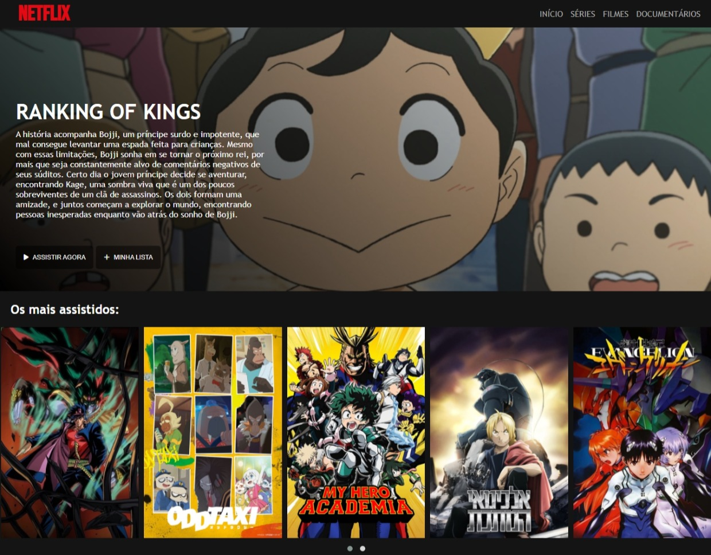

# Clone da Netflix 

### Clone do front da página inicial da Netflix para o desafio da DIO.

  Print da página

**Conhecimentos aprendidos e utilizados:**
- Mediaquerys; 
- Flexbox;
- Utilização do line-gradient no CSS.
- Biblioteca do framework de [Jquery OWL](https://owlcarousel2.github.io/OwlCarousel2/) para construir o carrossel;
- Biblioteca de ícones do [font awesome](https://fontawesome.com/);
- Uso da API do [Google fonts](https://fonts.google.com/);
